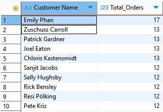
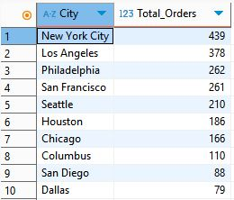
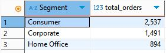
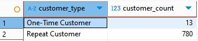
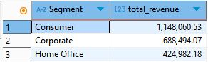
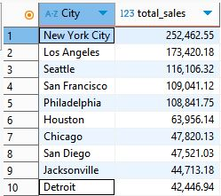

# 🛒 Superstore SQL Analysis

This project is a SQL-based data analysis of the popular Superstore dataset. Queries were executed using **SQLite** in **DBeaver**, focusing on uncovering insights related to customer behavior, order trends, segment revenue, and regional performance.

---

## 📌 Objectives

- Identify top-performing customers and cities
- Analyze customer segment contribution to sales
- Understand one-time vs repeat customer behavior
- Rank customers by total orders using window functions
- Summarize key revenue metrics by segment and region

---

## 🛠️ Tools & Technologies

- **Database**: SQLite
- **Editor**: DBeaver
- **Dataset**: Superstore (from Kaggle)
- **Key SQL Techniques**:
  - `COUNT`, `SUM`, `ROUND`, `GROUP BY`, `ORDER BY`
  - `RANK()` window function
  - `CASE WHEN` and subqueries

---

## 📁 Project Structure

superstore-sql-analysis/
│
├── /queries/ # Individual query files
│ ├── top_customers.sql
│ ├── top_cities_by_orders.sql
│ ├── segment_order_breakdown.sql
│ ├── repeat_vs_one_time.sql
│ ├── rank_customers.sql
│ ├── revenue_by_segment.sql
│ ├── sales_by_city.sql
│
├── superstore_analysis_all_queries.sql # Full script with all 7 queries
├── README.md # This file

## 📊 Business Questions & Query Coverage

| No. | Business Question                               | Query Description                            |
|-----|--------------------------------------------------|-----------------------------------------------|
| 1   | Who are the top 10 most frequent customers?      | Counts unique orders per customer             |
| 2   | Which cities have the most orders?               | Groups orders by city                         |
| 3   | How are customer segments distributed?           | Orders breakdown by segment                   |
| 4   | How many repeat vs one-time customers exist?     | Uses subquery to classify customer behavior   |
| 5   | Who are the top-ranked customers by activity?    | Uses `RANK()` window function                 |
| 6   | Which segment generates the highest revenue?     | `SUM(Sales)` grouped by segment               |
| 7   | Which cities generate the most sales revenue?    | `SUM(Sales)` grouped by city                  |

---

## 📸 Sample Query Outputs

### 1️⃣ Top 10 Customers by Orders

### 2️⃣ Top Cities by Total Orders

### 3️⃣ Customer Segment Breakdown

### 4️⃣ Repeat vs One-Time Customers

### 5️⃣ Ranked Customers by Orders

### 6️⃣ Revenue by Customer Segment

### 7️⃣ Revenue by City

---

## 📬 Contact

Created by [Bilal Abdul Sathar](https://www.linkedin.com/in/bilalas/)  
Open to feedback, collaboration, and data opportunities!
